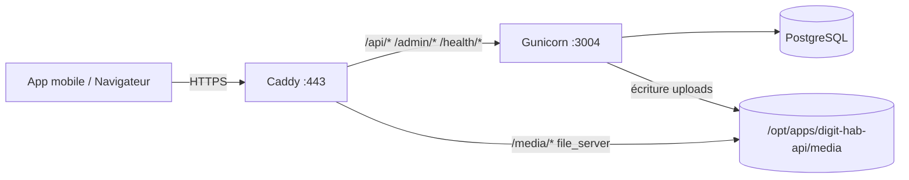

# Guide complet — API Django Digit-Hab sur VPS Wolof Digital

**Domaine public :** `https://api.digit-hab.wolofdigital.site`  
**Backend local :** Gunicorn sur `127.0.0.1:3004`  
**HTTPS / reverse proxy :** Caddy (ports 80 et 443)  
**Dépôt :** [DIGIT-HABs/digit-hab-api](https://github.com/DIGIT-HABs/digit-hab-api)

Ce document décrit le déploiement validé sur le VPS **vps120579** (Wolof-Wave), avec systemd + PostgreSQL + stockage médias local.

---

## Table des matières

1. [Architecture](#1-architecture)
2. [Prérequis](#2-prérequis)
3. [Checklist de mise en production](#3-checklist-de-mise-en-production)
4. [DNS](#4-dns)
5. [Installation du code](#5-installation-du-code)
6. [PostgreSQL](#6-postgresql)
7. [Fichier `.env`](#7-fichier-env)
8. [Migrations et superutilisateur](#8-migrations-et-superutilisateur)
9. [Dossier médias](#9-dossier-médias)
10. [systemd (Gunicorn)](#10-systemd-gunicorn)
11. [Caddy (HTTPS + médias)](#11-caddy-https--médias)
12. [Application mobile (Expo)](#12-application-mobile-expo)
13. [Mise à jour après déploiement](#13-mise-à-jour-après-déploiement)
14. [Scripts utilitaires](#14-scripts-utilitaires)
15. [Dépannage](#15-dépannage)
16. [Option Docker Compose](#16-option-docker-compose)
17. [Récapitulatif des ports](#17-récapitulatif-des-ports)

---

## 1. Architecture



| Composant | Rôle |
|-----------|------|
| **Caddy** | Certificats Let's Encrypt, redirection HTTP→HTTPS, proxy vers Django, **sert les fichiers `/media/`** |
| **Gunicorn** | WSGI Django (`digit_hab_crm.wsgi:application`) |
| **PostgreSQL** | Base `digit_hab_crm_prod` sur `127.0.0.1` |
| **`/opt/apps/digit-hab-api/media`** | Images propriétés, logos agences, etc. |

**Important :** ne pas utiliser `config.wsgi` ni `digit_hab_crm.settings.dev` en production.

| Paramètre | Valeur correcte |
|-----------|-----------------|
| WSGI | `digit_hab_crm.wsgi:application` |
| Settings | `digit_hab_crm.settings.prod` |
| Port Gunicorn | `3004` (Wolof WiFi Pay utilise `3001`) |

---

## 2. Prérequis

- VPS Ubuntu 22.04+ avec IP fixe
- Utilisateur `deploy` avec accès à `/opt/apps`
- Ports **80**, **443** ouverts (pare-feu + hébergeur)
- **Caddy** installé et actif (voir `Django/vps/README.md`)
- Python 3.10+ (`python3 --version`)
- PostgreSQL 14+ (local ou Docker)

---

## 3. Checklist de mise en production

À la fin du déploiement, ces commandes doivent réussir :

```bash
# Santé API
curl -sI https://api.digit-hab.wolofdigital.site/health/
# → HTTP/2 200

# Admin Django
curl -sI -H "Host: api.digit-hab.wolofdigital.site" http://127.0.0.1:3004/admin/
# → HTTP/1.1 302 (redirection login)

# Image média (fichier existant)
curl -sI https://api.digit-hab.wolofdigital.site/media/properties/images/image.jpg
# → HTTP/2 200 (idéalement server: Caddy, pas gunicorn)

# Diagnostic global
sudo bash /opt/apps/digit-hab-api/Django/vps/deploy-verify.sh
```

---

## 4. DNS

Chez le registrar (zone `wolofdigital.site`), créer un enregistrement **A** :

| Nom | Type | Valeur |
|-----|------|--------|
| `api.digit-hab` | A | IP du VPS (même IP que `wifi.wolofdigital.site`) |

Vérification :

```bash
dig +short api.digit-hab.wolofdigital.site
```

---

## 5. Installation du code

```bash
sudo mkdir -p /opt/apps/digit-hab-api
sudo chown deploy:deploy /opt/apps/digit-hab-api

sudo -u deploy bash -lc '
  cd /opt/apps
  git clone https://github.com/DIGIT-HABs/digit-hab-api.git digit-hab-api
  cd digit-hab-api
  python3 -m venv venv
  source venv/bin/activate
  pip install -U pip wheel
  pip install -r requirements.txt gunicorn
'
```

> **Note :** toujours activer le **venv** avant `python`, `manage.py` ou les scripts (`create_test_data_prod.py`). Le `python3` système n’a pas Django.

---

## 6. PostgreSQL

### Installation automatique

Le `.env` doit contenir `DB_NAME`, `DB_USER`, `DB_PASSWORD`, `DB_HOST=127.0.0.1` :

```bash
sudo bash /opt/apps/digit-hab-api/Django/vps/setup-postgres.sh
```

### Installation manuelle (alternative)

```bash
sudo apt install -y postgresql postgresql-contrib
sudo -u postgres psql
```

```sql
CREATE USER digit_hab_crm_user WITH PASSWORD 'votre_mot_de_passe';
CREATE DATABASE digit_hab_crm_prod OWNER digit_hab_crm_user;
GRANT ALL PRIVILEGES ON DATABASE digit_hab_crm_prod TO digit_hab_crm_user;
\q
```

```bash
sudo -u postgres psql -d digit_hab_crm_prod -c "GRANT ALL ON SCHEMA public TO digit_hab_crm_user;"
```

Test connexion :

```bash
PGPASSWORD='votre_mot_de_passe' psql -h 127.0.0.1 -U digit_hab_crm_user -d digit_hab_crm_prod -c '\dt'
```

---

## 7. Fichier `.env`

```bash
sudo -u deploy cp /opt/apps/digit-hab-api/Django/vps/.env.example /opt/apps/digit-hab-api/.env
sudo -u deploy nano /opt/apps/digit-hab-api/.env
sudo chmod 600 /opt/apps/digit-hab-api/.env
sudo chown deploy:deploy /opt/apps/digit-hab-api/.env
```

### Modèle complet (à adapter)

```env
DJANGO_SETTINGS_MODULE=digit_hab_crm.settings.prod
SECRET_KEY=change-me-long-random-string
DEBUG=False

ALLOWED_HOSTS=api.digit-hab.wolofdigital.site,127.0.0.1,localhost
CSRF_TRUSTED_ORIGINS=https://api.digit-hab.wolofdigital.site
CORS_ALLOWED_ORIGINS=https://api.digit-hab.wolofdigital.site

# PostgreSQL — DB_HOST=db uniquement dans Docker Compose
DB_ENGINE=django.db.backends.postgresql
DB_NAME=digit_hab_crm_prod
DB_USER=digit_hab_crm_user
DB_PASSWORD=change-me
DB_HOST=127.0.0.1
DB_PORT=5432

# Redis (optionnel — prod.py utilise DummyCache si absent)
REDIS_URL=redis://:change-me@127.0.0.1:6379/0
CELERY_BROKER_URL=redis://:change-me@127.0.0.1:6379/0
CELERY_RESULT_BACKEND=redis://:change-me@127.0.0.1:6379/0

# Médias — stockage local sur le VPS (recommandé)
MEDIA_ROOT=/opt/apps/digit-hab-api/media
SERVE_MEDIA=true
USE_CLOUDINARY=false

# Ne PAS laisser CLOUDINARY_URL sans USE_CLOUDINARY=true
# et sans django-cloudinary-storage installé (sinon 500 sur upload d'images)

# Email (optionnel)
EMAIL_HOST=smtp.gmail.com
EMAIL_PORT=587
EMAIL_USE_TLS=True
EMAIL_HOST_USER=
EMAIL_HOST_PASSWORD=
```

### Erreurs `.env` fréquentes

| Variable incorrecte | Symptôme |
|---------------------|----------|
| `DJANGO_SETTINGS_MODULE=digit_hab_crm.settings.dev` | Comportement dev, hôtes incorrects |
| `DB_HOST=db` hors Docker | Gunicorn ne démarre pas / DB inaccessible |
| `CLOUDINARY_URL=...` sans package cloudinary-storage | **500** sur `POST .../add_image/` |
| `ALLOWED_HOSTS` sans le domaine Wolof | **400** sur `/admin` |
| `MEDIA_ROOT` vers `digit_hab_crm/media` | Upload OK mais **404** sur les URLs `/media/` |

`prod.py` fusionne les domaines Wolof/Altoppe avec ceux du `.env` pour `ALLOWED_HOSTS` et `CSRF_TRUSTED_ORIGINS`.

---

## 8. Migrations et superutilisateur

```bash
sudo -u deploy bash -lc '
  cd /opt/apps/digit-hab-api
  source venv/bin/activate
  set -a && source .env && set +a
  python manage.py migrate --noinput
  python manage.py collectstatic --noinput
  python manage.py createsuperuser
'
```

### Données de démonstration (optionnel)

```bash
sudo -u deploy bash -lc '
  cd /opt/apps/digit-hab-api
  source venv/bin/activate
  set -a && source .env && set +a
  python create_test_data_prod.py
'
```

---

## 9. Dossier médias

Les fichiers uploadés sont stockés sous :

```text
/opt/apps/digit-hab-api/media/
  properties/images/
  properties/thumbnails/
  agencies/logos/
  ...
```

Création et permissions :

```bash
sudo bash /opt/apps/digit-hab-api/Django/vps/setup-media.sh
```

Vérification :

```bash
ls -la /opt/apps/digit-hab-api/media/properties/images/
```

---

## 10. systemd (Daphne ASGI — requis pour WebSockets)

**Important :** Gunicorn (`wsgi:application`) ne gère **pas** les WebSockets (`/ws/messaging/`, `/ws/notifications/`). Utilisez **Daphne** avec `asgi:application`.

```bash
sudo cp /opt/apps/digit-hab-api/Django/vps/systemd/digit-hab-api.service.example \
  /etc/systemd/system/digit-hab-api.service
```

Points à contrôler dans `/etc/systemd/system/digit-hab-api.service` :

| Directive | Valeur attendue |
|-----------|-----------------|
| `User` / `Group` | `deploy` |
| `WorkingDirectory` | `/opt/apps/digit-hab-api` |
| `Environment` | `DJANGO_SETTINGS_MODULE=digit_hab_crm.settings.prod` |
| `EnvironmentFile` | `-/opt/apps/digit-hab-api/.env` |
| `ExecStart` | `.../daphne -b 127.0.0.1 -p 3004 digit_hab_crm.asgi:application` |

Redis doit tourner (`redis-server`) : `CHANNEL_LAYERS` en prod utilise Redis.

Correction automatique si l’ancienne unité référence `config.wsgi` :

```bash
sudo bash /opt/apps/digit-hab-api/Django/vps/fix-systemd-unit.sh
```

Activation :

```bash
sudo systemctl daemon-reload
sudo systemctl enable --now digit-hab-api.service
sudo systemctl status digit-hab-api.service --no-pager
curl -sI http://127.0.0.1:3004/health/
```

Logs en continu :

```bash
sudo journalctl -u digit-hab-api.service -f
```

### Vérifier les WebSockets (chat)

```bash
# Doit répondre 101 Switching Protocols (pas 404/502)
curl -sI -N \
  -H "Connection: Upgrade" \
  -H "Upgrade: websocket" \
  -H "Sec-WebSocket-Version: 13" \
  -H "Sec-WebSocket-Key: dGhlIHNhbXBsZSBub25jZQ==" \
  "https://api.digit-hab.wolofdigital.site/ws/messaging/chat/00000000-0000-0000-0000-000000000000/"
```

Si la connexion échoue alors que `/api/` fonctionne : l’unité systemd utilise encore Gunicorn → repasser à Daphne (voir ci-dessus).

---

## 11. Caddy (HTTPS + médias)

### Bloc obligatoire pour Digit-Hab

Le bloc **ne doit pas** être un simple `reverse_proxy` : les fichiers `/media/` doivent être servis par Caddy **avant** Django.

Fichier de référence : `Django/vps/caddy/Caddyfile`

```caddy
{
	email contact@wolofdigital.com
}

# ... autres sites (wifi, etc.) ...

api.digit-hab.wolofdigital.site {
	handle /media/* {
		root * /opt/apps/digit-hab-api
		file_server
	}
	handle {
		reverse_proxy 127.0.0.1:3004
	}
}
```

### Installation

```bash
# Fusionner manuellement dans /etc/caddy/Caddyfile, ou :
sudo cp /opt/apps/digit-hab-api/Django/vps/caddy/Caddyfile /etc/caddy/Caddyfile

sudo caddy validate --config /etc/caddy/Caddyfile
sudo systemctl reload caddy
```

### Installation automatique du bloc médias

Si le site existe déjà avec un ancien `reverse_proxy` seul :

```bash
sudo bash /opt/apps/digit-hab-api/Django/vps/install-caddy-media.sh
```

### Tests médias

```bash
# Direct Gunicorn (repli Django si SERVE_MEDIA=true)
curl -sI http://127.0.0.1:3004/media/properties/images/image.jpg

# Public HTTPS (idéal : 200, en-tête sans server: gunicorn)
curl -sI https://api.digit-hab.wolofdigital.site/media/properties/images/image.jpg
```

| Résultat | Interprétation |
|----------|----------------|
| Local 200, HTTPS 404 + `server: gunicorn` | Caddy n’a pas `handle /media/*` → corriger Caddyfile |
| Local 404, fichier présent sur disque | `MEDIA_ROOT` incorrect ou code pas à jour → `git pull`, vérifier `.env` |
| HTTPS 200 + `server: Caddy` | Configuration médias OK |

### Repli Django (`SERVE_MEDIA=true`)

Si Caddy n’est pas encore configuré, Django peut servir `/media/` temporairement (`SERVE_MEDIA=true` dans `.env`). En production stable, privilégier Caddy pour les performances.

### Domaines commentés dans le Caddyfile

Commenter les blocs sans DNS valide (ex. `apisign.wolofdigtal.com` — faute de frappe) pour éviter les erreurs ACME NXDOMAIN dans les logs. Cela n’empêche pas le certificat de `api.digit-hab.wolofdigital.site`.

---

## 12. Application mobile (Expo)

Dans `Native/config/api.config.ts` :

```typescript
const API_BASE_PROD = `https://api.digit-hab.wolofdigital.site`;
```

Rebuild / redémarrer Expo après changement. Les uploads d’images utilisent `POST /api/properties/{id}/add_image/` en multipart (champ `image`).

---

## 13. Mise à jour après déploiement

```bash
sudo -u deploy bash -lc '
  cd /opt/apps/digit-hab-api
  git pull
  source venv/bin/activate
  pip install -r requirements.txt
  set -a && source .env && set +a
  python manage.py migrate --noinput
  python manage.py collectstatic --noinput
'
sudo systemctl restart digit-hab-api.service
```

---

## 14. Scripts utilitaires

| Script | Usage |
|--------|--------|
| `Django/vps/deploy-verify.sh` | Diagnostic ports, health, médias, `.env` |
| `Django/vps/setup-postgres.sh` | Crée DB + utilisateur PostgreSQL |
| `Django/vps/setup-media.sh` | Dossiers médias + permissions `deploy` |
| `Django/vps/fix-systemd-unit.sh` | Corrige `config.wsgi` → `digit_hab_crm.wsgi` |
| `Django/vps/install-caddy-media.sh` | Ajoute `handle /media/*` au Caddyfile |
| `Django/vps/caddy/Caddyfile` | Modèle Caddy multi-sites |
| `Django/vps/systemd/digit-hab-api.service.example` | Unité systemd Gunicorn |
| `Django/vps/.env.example` | Modèle variables d’environnement |
| `Django/create_test_data_prod.py` | Données de démo (agence, biens, comptes test) |

---

## 15. Dépannage

### `Connection refused` sur le port 3004

```bash
sudo systemctl status digit-hab-api.service --no-pager
sudo journalctl -u digit-hab-api.service -n 80 --no-pager
sudo ss -tlnp | grep 3004
```

Causes : service arrêté, mauvais WSGI (`config.wsgi`), PostgreSQL inaccessible, `DB_HOST=db` hors Docker.

Test manuel :

```bash
sudo -u deploy bash -lc '
  cd /opt/apps/digit-hab-api
  source venv/bin/activate
  export DJANGO_SETTINGS_MODULE=digit_hab_crm.settings.prod
  set -a && source .env && set +a
  gunicorn digit_hab_crm.wsgi:application --bind 127.0.0.1:3004
'
```

### `Bad Request (400)` sur `/admin`

**DisallowedHost** — ajouter le domaine dans `.env` :

```env
ALLOWED_HOSTS=api.digit-hab.wolofdigital.site,127.0.0.1,localhost
CSRF_TRUSTED_ORIGINS=https://api.digit-hab.wolofdigital.site
DJANGO_SETTINGS_MODULE=digit_hab_crm.settings.prod
```

```bash
curl -sI -H "Host: api.digit-hab.wolofdigital.site" http://127.0.0.1:3004/admin/
# → 302 attendu
sudo systemctl restart digit-hab-api.service
```

### `500` sur `POST /api/properties/.../add_image/`

1. Retirer `CLOUDINARY_URL` ou `USE_CLOUDINARY=false`
2. `sudo bash Django/vps/setup-media.sh`
3. `sudo systemctl restart digit-hab-api.service`
4. Logs : `sudo journalctl -u digit-hab-api.service -n 80 | grep -i add_image`

### Upload OK mais `/media/...` en 404

Voir [§ 11 Caddy](#11-caddy-https--médias). Le fichier doit exister :

```bash
ls -la /opt/apps/digit-hab-api/media/properties/images/
```

Vérifier les settings Django :

```bash
sudo -u deploy bash -lc '
  cd /opt/apps/digit-hab-api
  source venv/bin/activate
  set -a && source .env && set +a
  python -c "
import django, os
os.environ.setdefault(\"DJANGO_SETTINGS_MODULE\", \"digit_hab_crm.settings.prod\")
django.setup()
from django.conf import settings
p = settings.MEDIA_ROOT / \"properties/images/image.jpg\"
print(\"MEDIA_ROOT\", settings.MEDIA_ROOT)
print(\"SERVE_MEDIA\", settings.SERVE_MEDIA)
print(\"exists\", p.exists())
"
'
```

### HTTPS `tls alert internal error`

Souvent Caddy sans backend sur 3004. Corriger Gunicorn d’abord, puis `sudo systemctl reload caddy`.

### `ModuleNotFoundError: No module named 'config'`

```bash
sudo sed -i 's/config\.wsgi:application/digit_hab_crm.wsgi:application/g' /etc/systemd/system/digit-hab-api.service
sudo sed -i 's/DJANGO_SETTINGS_MODULE=config\.settings/DJANGO_SETTINGS_MODULE=digit_hab_crm.settings.prod/g' /etc/systemd/system/digit-hab-api.service
sudo systemctl daemon-reload && sudo systemctl restart digit-hab-api.service
```

### `python: command not found` / `No module named django`

Utiliser le venv :

```bash
source /opt/apps/digit-hab-api/venv/bin/activate
```

---

## 16. Option Docker Compose

Alternative à systemd : stack complète (Postgres + Redis + web) comme sur l’ancien VPS.

```bash
cd /opt/apps/digit-hab-api
# .env adapté (DB_HOST=db dans ce cas)
sudo -u deploy docker compose -f docker-compose.prod.yml -f docker-compose.vps.yml up -d --build
```

`docker-compose.vps.yml` expose le conteneur web sur **127.0.0.1:3004** (aligné avec Caddy). Pas besoin de `digit-hab-api.service` si tout tourne dans Docker.

---

## 17. Récapitulatif des ports

| Port | Service |
|------|---------|
| 3001 | Wolof WiFi Pay (Node) |
| 3002 | wolof Sign (si activé) |
| 3003 | e-wolof (si activé) |
| **3004** | **Digit-Hab API (Django / Gunicorn)** |
| 443 | Caddy (HTTPS public) |
| 5432 | PostgreSQL (local uniquement) |

---

## URLs utiles en production

| URL | Description |
|-----|-------------|
| `https://api.digit-hab.wolofdigital.site/health/` | Santé API |
| `https://api.digit-hab.wolofdigital.site/admin/` | Interface admin Django |
| `https://api.digit-hab.wolofdigital.site/api/docs/` | Swagger OpenAPI |
| `https://api.digit-hab.wolofdigital.site/api/` | Endpoints REST |
| `https://api.digit-hab.wolofdigital.site/media/...` | Fichiers uploadés |

---

*Dernière mise à jour : déploiement validé mai 2026 — médias, admin, uploads images opérationnels sur `api.digit-hab.wolofdigital.site`.*
